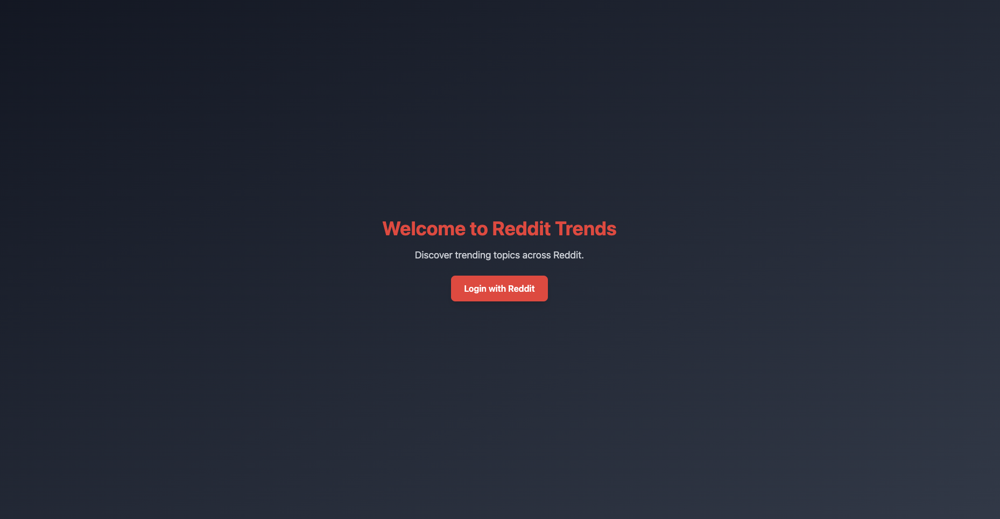

# Reddit Trends - Flask App
Reddit Trends is a web application built with Flask that allows users to fetch and display trending posts from various subreddits. Users can also receive email alerts with the latest trending posts.

# Demo
<p align="left">
  <a href="media/reddit-trends-demo.mp4">
    
  </a>
</p>

## Overview
This is a Flask-based web application that:
- **Fetches trending posts** from selected subreddits using the **Reddit API**.
- **Displays trending posts** on the dashboard.
- **Allows users to send email alerts** containing trending Reddit posts to specified email addresses.
- Uses **Flask-Mail** for email notifications.
- Uses **SQLite** for storing Reddit posts and subreddits.
- Implements **OAuth2 authentication** with Reddit.

## Features
- User authentication with Reddit OAuth  
- Fetches trending posts from subreddits using dynamic search (adding and removing)  
- Sends email alerts dynamically to user-specified email addresses  
- Uses **dotenv** to protect API credentials  
- Supports debugging and testing with **Postman**  

## Setup Instructions

### 1. Clone the Repository
```bash
git clone https://github.com/dristanta-silwal/reddit-trends.git
cd reddit-trends
```

### 2. Install Dependencies
Make sure you have Python 3+ installed, then run:
```bash
pip install -r requirements.txt
```

### 3. Create a .env File
Create a .env file in the project directory and add:
```
SECRET_KEY=your_secret_key

# Reddit API Credentials
CLIENT_ID=your_reddit_client_id
CLIENT_SECRET=your_reddit_client_secret
REDIRECT_URI=http://127.0.0.1:5000/callback

# Mail Server Configuration
MAIL_SERVER=your_smtp
MAIL_PORT=587
MAIL_USERNAME=your_email@gmail.com
MAIL_PASSWORD=your_email_password
MAIL_USE_TLS=True
MAIL_USE_SSL=False
```
**Important:** Do not commit .env to GitHub! Add .env to .gitignore.

### 4. Run the Application
```bash
python server.py
```
The app will be available at: [http://127.0.0.1:5000](http://127.0.0.1:5000)

## Reddit API Setup
To use the Reddit API:
1. Go to [Reddit Apps](https://www.reddit.com/prefs/apps).
2. Click “Create an app” and choose “script”.
3. Fill in:
    - App name: Reddit Trends App
    - Redirect URI: http://127.0.0.1:5000/callback
4. Copy Client ID and Client Secret into your .env file.

## Testing API Endpoints in Postman

### 1. Authenticate User
- **Endpoint:** GET /login
- **Description:** Redirects to Reddit OAuth login.

### 2. Fetch Trending Posts
- **Endpoint:** GET /dashboard
- **Expected Response:**
```json
{
  "id": "post_id",
  "title": "Trending post title",
  "subreddit": "technology",
  "upvotes": 1234,
  "comments": 567,
  "permalink": "https://reddit.com/r/technology/post"
}
```

### 3. Send Email Alerts
- **Endpoint:** POST /dashboard/send_alerts
- **Body (form-data or raw JSON):**
```json
{
  "emails": "user1@example.com, user2@example.com"
}
```
- **Expected Response:** “Trending Reddit posts have been sent via email!”

## Debugging Tips

### Common Errors

| Issue | Cause | Solution |
|-------|-------|----------|
| CLIENT_ID is None | .env not loaded | Run `pip install python-dotenv` & check .env |
| 500 Internal Server Error | Incorrect email credentials | Ensure correct email & allow “Less Secure Apps” in Gmail |
| OAuth2 Authorization Failed | Invalid Client ID | Double-check credentials from Reddit |

### Debug with Flask
Run Flask with debugging enabled:
```bash
python server.py
```
or
```bash
export FLASK_DEBUG=1
flask run
```

### Debug API Calls with Postman
- Use Postman to test API responses before integrating into frontend.
- Inspect logs using:
```bash
tail -f flask.log
```

## Future Improvements
- Add user authentication (so users can log in and manage subscriptions).
- Implement database storage to save user preferences.
- Enable scheduled emails (send daily trending posts automatically).

## Author
Built by Dristanta Silwal